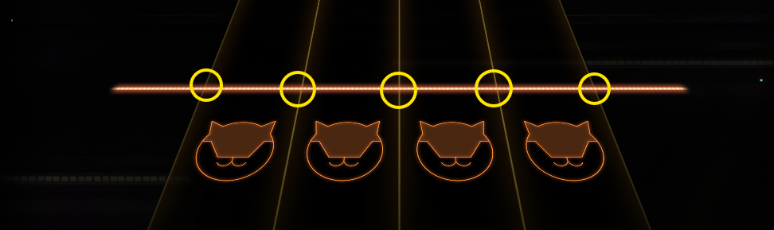

# Nikke TTS Color Bot

<p align="center">
  
</p>

A high-performance rhythm game bot for NIKKE: Goddess of Victory's Tracing The Stars (TTS) minigame. Uses DXGI Desktop Duplication for GPU-accelerated screen capture and pixel-perfect note detection.

## Features

- **300 FPS** capture rate with DXGI Desktop Duplication
- **GPU-accelerated** screen capture (zero CPU overhead)
- **Independent key handling** - all 7 keys work simultaneously without blocking
- **Hold detection** with dual measurement points for accuracy
- **Smart timing** - 10ms repress cooldown, 40ms grace period for holds
- **Color-based detection** - White, Gold, Green, and Purple notes
- **Scan code input** - Works with DirectInput games

## Requirements

- Windows 10/11
- **Requires 1920x1080 resolution (1080p) with 100% display scaling**
- Visual Studio 2019 or newer (for compilation)
- Administrator privileges (auto-requested on first run)
- NIKKE game with Tracing The Stars minigame

> **⚠️ IMPORTANT:** The bot uses fixed scan regions calibrated for 1080p. Other resolutions or display scaling settings will not work correctly.

## Game Configuration

**IMPORTANT:** Configure your in-game keybinds to match:

| Note Color | Keys |
|------------|------|
| White notes | `D` `F` `J` `K` |
| Gold note | `B` |
| Green note | `A` |
| Purple note | `L` |

## Installation

### Option 1: Download Pre-compiled Binary

1. Run `color_bot.exe` (will request admin privileges)
2. Press `F9` to calibrate
3. Press `F8` to start/stop

### Option 2: Compile from Source

#### Prerequisites

- Visual Studio 2019 or newer with C++ Desktop Development workload
- Windows SDK

#### Build Steps

1. Clone the repository:
```bash
git clone https://github.com/yourusername/nikke-tts-bot.git
cd nikke-tts-bot
```

2. Run the build script:
```bash
build.bat
```

Or compile manually:
```bash
# Initialize Visual Studio environment
call "C:\Program Files\Microsoft Visual Studio\[VERSION]\Community\VC\Auxiliary\Build\vcvars64.bat"

# Compile resource file
rc.exe color_bot.rc

# Compile program
cl.exe color_bot.cpp /O2 /EHsc /W3 /D_CRT_SECURE_NO_WARNINGS /Fe:color_bot.exe ^
    d3d11.lib dxgi.lib winmm.lib user32.lib shell32.lib advapi32.lib ^
    /link /SUBSYSTEM:CONSOLE color_bot.res
```

## Usage

### First Time Setup

1. **Launch the bot:**
   ```bash
   color_bot.exe
   ```
   - Bot will automatically request administrator privileges
   - A console window will open with instructions

2. **Calibrate (F9):**
   - Start the Tracing The Stars minigame
   - Press `F9` in the bot console
   - Click 5 points on the hit line (left to right):
     - Left edge of lane 1
     - Right edge of lane 1 / Left edge of lane 2
     - Right edge of lane 2 / Left edge of lane 3
     - Right edge of lane 3 / Left edge of lane 4
     - Right edge of lane 4
   - Calibration is saved to `bot_config.json`

   <p align="center">
     
   </p>

3. **Start the bot (F8):**
   - Press `F8` to start
   - Bot will automatically play the minigame
   - Press `F8` again to stop

### Controls

| Key | Action |
|-----|--------|
| `F8` | Start/Stop bot |
| `F9` | Calibration |
| `F10` | Exit program |

## Configuration

The bot saves calibration data to `bot_config.json`:

```json
{
    "hit_zone_y": 1080,
    "lane_centers_x": [100, 200, 300, 400],
    "lane_hold_x": [85, 185, 285, 385],
    "lane_keys": ["d", "f", "j", "k"],
    "green_x": 90,
    "purple_x": 410,
    "gold_x": 400,
    "green_tap_x": 200,
    "purple_tap_x": 300,
    "special_scan_half": 6
}
```

### Advanced Tuning

Edit `color_bot.cpp` constants for fine-tuning:

```cpp
#define SCAN_Y_A_OFFSET    18   // Top scan boundary (px above hit line)
#define SCAN_Y_B_OFFSET    51   // Bottom scan boundary (px above hit line)
#define SCAN_Y_GOLD_OFFSET 80   // Gold note scan height (px above hit line)
#define TARGET_FPS         300.0 // Capture frame rate
#define KEY_REPRESS_COOLDOWN 0.01 // 10ms between key presses
```

Color detection thresholds:

```cpp
c.white  = R > 185 && G > 185 && B > 185;
c.dark   = R < 60  && G < 60  && B < 60;
c.green  = G > 130 && G > R + 30 && G > B + 15;
c.purple = R > 130 && B > 120 && G < 120;
c.gold   = R > 240 && G > 215 && B > 110 && B < 145;
```

## How It Works

1. **DXGI Capture:** Uses DirectX Graphics Infrastructure to capture frames directly from GPU memory
2. **Color Classification:** Analyzes pixel colors in scan regions above the hit line
3. **Note Detection:**
   - **White notes:** Detected at lane centers with hold detection at lane edges
   - **Gold note:** Scanned in a higher region (80px above hit line)
   - **Green/Purple notes:** Zone-based detection across all lanes
4. **Input Simulation:** Sends keyboard input using Windows SendInput API with hardware scan codes

## Limitations

- **Resolution locked:** Requires 1920x1080 (1080p) with 100% Windows display scaling
- **Pixel-based detection:** Visual effects (glows, flashes) after gold notes may occasionally cause false detections
- **Calibration required:** Must recalibrate if game resolution or UI scale changes
- **Single monitor:** Captures primary monitor only

## Troubleshooting

### Bot doesn't press keys
- **Verify display settings:** Game must run at 1920x1080 with 100% Windows scaling
- Verify game keybinds match bot configuration (D F J K B A L)
- Ensure bot is running as administrator
- Check that game window is on primary monitor

### Keys stuck/held too long
- Recalibrate (F9) - calibration may be off
- Ensure 1080p resolution and 100% scaling
- Check `SCAN_Y_A_OFFSET` and `SCAN_Y_B_OFFSET` values

### Missing notes
- **Check resolution:** Must be 1920x1080 at 100% scaling
- Increase `SCAN_Y_GOLD_OFFSET` for gold notes
- Adjust color thresholds in `classify()` function
- Lower `TARGET_FPS` if system can't keep up

### Compilation errors
- Ensure Visual Studio C++ Desktop Development workload is installed
- Check that Windows SDK is installed
- Verify `vcvars64.bat` path in `build.bat` matches your VS installation

## Technical Details

- **Language:** C++
- **Graphics API:** Direct3D 11, DXGI 1.2
- **Input Method:** Windows SendInput with scan codes
- **Architecture:** Single-threaded event loop at 300 FPS
- **Memory:** ~10MB RAM usage
- **CPU:** <1% on modern processors (GPU does the heavy lifting)

## License

MIT License - See [LICENSE](LICENSE) file for details

## Disclaimer

This bot is for educational purposes. Use at your own risk. The authors are not responsible for any consequences of using this software, including but not limited to game bans or account suspensions.

## Contributing

Contributions are welcome! Please feel free to submit a Pull Request.

## Credits

- DXGI Desktop Duplication implementation
- Windows SendInput for reliable input simulation
- Optimized color detection algorithms

---

**Note:** This bot is designed specifically for NIKKE's Tracing The Stars minigame. It may not work with other rhythm games without modification.
